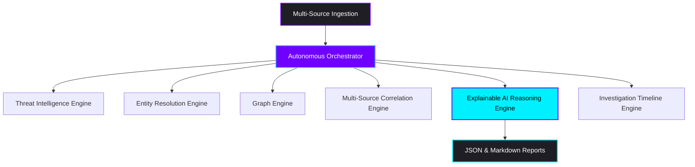

```
██████   █████  ██   ██ ███████ ██   ██  █████  ███████ ████████ ██████   █████  
██   ██ ██   ██ ██  ██  ██      ██   ██ ██   ██ ██         ██    ██   ██ ██   ██ 
██████  ███████ █████   ███████ ███████ ███████ ███████    ██    ██████  ███████ 
██   ██ ██   ██ ██  ██       ██ ██   ██ ██   ██      ██    ██    ██   ██ ██   ██ 
██   ██ ██   ██ ██   ██ ███████ ██   ██ ██   ██ ███████    ██    ██   ██ ██   ██ 
```

<div align="center">

# ☤ RAKSHASTRA
### The Autonomous AI-Powered Cyber Investigation Operating System

[](https://python.org)
[](https://deepmind.google/technologies/gemini/)
[](docs/algorand_x402_plan.md)
[](LICENSE)

*Built from the ground up for the **Google Gemini** family of models, integrating massive context processing, multi-source footprint correlation, interactive relationship graphs, and Algorand-backed micro-billing.*

</div>

---

## ⚡ What is Rakshastra?

**Rakshastra** (Sanskrit for *Cyber Weaponry / Defense Shield*) is an autonomous AI-native threat intelligence and investigation platform designed for SMEs and digital forensics teams. 

Unlike traditional security systems that generate noisy, unstructured alerts, Rakshastra operates as an **Autonomous Cyber Investigator**. It digests heterogeneous raw intelligence (Telegram/WhatsApp/Discord chat exports, emails, PDFs, OCR screenshots), maps operator alias connections, detects bot activity, and generates human-readable, step-by-step **Explainable AI (XAI)** threat intelligence reports.

---

## 💎 Flagship Pillars

| Pillar | Capability | Tech Stack / Implementation |
| :--- | :--- | :--- |
| **🧠 Gemini-First Core** | 1M+ token context ingestion, native multi-modal image/document parsing, high-fidelity tool dispatch. | Google Gemini 2.5/3.x Flash & Pro native API integration. |
| **🔗 Multi-Source Correlation** | Detects infrastructure reuse across separate communication channels and aliases. | Entity Resolution Engine + SQLite FTS5 & Vector Embeddings. |
| **🛡️ Explainable AI (XAI)** | Logical step-by-step reasoning chains, counter-evidence gaps, and trust confidence scores. | Structured JSON output models & Markdown investigator dossiers. |
| **💳 x402 Micropayments** | Secure, decentralized pay-per-request API billing verification for external queries. | Algorand Smart Contracts & Payment Verification Hooks. |
| **💻 Windows Companion** | On-premise local credential scanning, desktop OCR ingestion, and offline templates. | Windows Desktop App distributed via `winget`. |

---

## 🏗️ System Architecture

Rakshastra coordinates multiple dedicated engines to transform raw inputs into structured intelligence:



### Core Components
* **Autonomous Orchestrator**: Manages investigation goal planning, dynamic task sequencing, and the evidence collection queue.
* **Threat Intelligence Engine**: Detects financial fraud, scam links, crypto theft, and credential phishing.
* **Entity Resolution Engine**: Normalizes and groups aliases, handles, phone numbers, and crypto wallets.
* **Graph Engine**: Renders force-directed connection diagrams mapping actor relationships.
* **Multi-Source Correlation Engine**: Checks for pattern similarities and indicator reuse across historical cases.
* **Explainable AI Engine**: Compiles logical reasoning trees explaining threat score attributions.
* **Investigation Timeline Engine**: Generates a chronological replay of threat events.

---

## ⚙️ Installation & Setup

### Requirements
* **Python**: `3.10` or `3.11`
* **Node.js**: `v18+` (for Vite web dashboard)
* **API Access**: Google Gemini API key

### 1. Backend Inception
Clone the repository and build the virtual environment:
```bash
git clone https://github.com/username/rakshastra.git
cd rakshastra
python -m venv .venv
source .venv/bin/activate  # On Windows: .venv\Scripts\activate
pip install -e .
```

### 2. Configure Credentials
Run the setup wizard to configure the Gemini-First onboarding flow:
```bash
rakshastra setup
```
This wizard will prompt you to:
1. Confirm **Google Gemini** as your primary reasoning provider.
2. Select your Gemini API key tier (Free vs Paid).
3. Validate and store your credentials securely.

### 3. Launch the API Gateway
Start the FastAPI backend server:
```bash
python rakshastra_cli/web_server.py
```

### 4. Launch the Web UI
Navigate to the dashboard repository, install dependencies, and start the hot-reload Vite interface:
```bash
cd web
npm install
npm run dev
```

---

## 🕹️ CLI Command Reference

Rakshastra includes a powerful unified command-line interface:

| Command | Subcommands | Purpose |
| :--- | :--- | :--- |
| `rakshastra setup` | N/A | Interactive onboarding wizard for models and credentials. |
| `rakshastra chat` | `[prompt]` | Start an interactive terminal-based investigator session. |
| `rakshastra model` | `[model_name]` | Instantly swap the active reasoning model. |
| `rakshastra gateway`| `start`, `stop`, `status` | Control WhatsApp, Telegram, and Discord listener daemons. |
| `rakshastra session`| `list`, `search`, `resume` | Query previous investigation history and session transcripts. |

---

## 🧪 Verification & Testing

To run the complete suite of backend, platform gateway, and engine tests:
```bash
python -m pytest tests/
```

To run targeted tests for the core threat intelligence engines:
```bash
python -m pytest tests/rakshastra_core/
```

---

## 📂 Documentation Index

Discover more about the platform architecture and deployment guides:
* 🗺️ **[Repository Map](docs/repo_map.md)** — Core folder structure and system organization.
* 🧠 **[Architecture Guide](docs/Architecture.md)** — Multi-engine interaction and security model.
* 🌐 **[REST API Reference](docs/API.md)** — Integration endpoints and pay-per-request documentation.
* 💳 **[x402 Algorand Spec](docs/algorand_x402_plan.md)** — Smart-contract micropayment protocols.
* 🗔 **[Windows Companion](docs/windows_companion_app.md)** — On-premise agent and scanner companion.
* 🚀 **[Deployment Manual](docs/Deployment.md)** — Docker, Compose, and production guidelines.
* 🎯 **[Product Strategy](docs/product_strategy.md)** — User personas, monetization models, and vision.
* 🤝 **[Hackathon Alignment](docs/hackathon_alignment.md)** — Gemini capabilities mapping.
* 📈 **[Milestones & Roadmap](docs/Roadmap.md)** — Feature milestones and roadmap.
