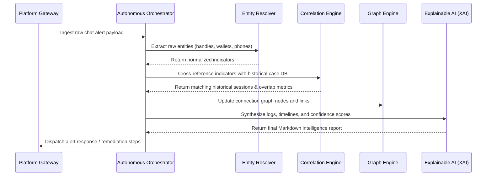

# ☤ RAKSHASTRA ARCHITECTURE SPECIFICATION
> **System Architecture, Engine Interaction, and Ingestion Pipeline Specifications**

This document details the multi-layered system architecture of the Rakshastra Cyber Investigation Platform, outlining how the core intelligence engines interact to resolve threat profiles from unstructured data.

---

## 🏛️ 1. Multi-Layered Overview

```
 ┌──────────────────────────────────────────────────────────┐
 │                PRESENTATION & INTERFACE                  │
 │   ┌──────────────────────┐    ┌──────────────────────┐   │
 │   │  React/Vite Web App  │    │ Windows Companion App│   │
 │   └──────────────────────┘    └──────────────────────┘   │
 └────────────────────────────┬─────────────────────────────┘
                              │ REST API / WebSockets
 ┌────────────────────────────▼─────────────────────────────┐
 │                GATEWAYS & CONTROLLERS                    │
 │   ┌──────────────────────┐    ┌──────────────────────┐   │
 │   │    FastAPI Server    │    │ Platform Gateways    │   │
 │   │   (x402 Enabled)     │    │ (WA, TG, Discord)    │   │
 │   └──────────────────────┘    └──────────────────────┘   │
 └────────────────────────────┬─────────────────────────────┘
                              │ Execution Context
 ┌────────────────────────────▼─────────────────────────────┐
 │               CORE INTELLIGENCE ENGINES                  │
 │   ┌──────────────────────┐    ┌──────────────────────┐   │
 │   │Autonomous Planner    │    │Entity Resolution     │   │
 │   ├──────────────────────┤    ├──────────────────────┤   │
 │   │Threat Intel Engine   │    │Graph Layout Engine   │   │
 │   ├──────────────────────┤    ├──────────────────────┤   │
 │   │Multi-Source Correlator│    │Explainable AI (XAI)  │   │
 │   └──────────────────────┘    └──────────────────────┘   │
 └──────────────────────────────────────────────────────────┘
```

---

## ⚡ 2. Technical Component Matrix

| Layer | Component | Description | Tech Stack |
| :--- | :--- | :--- | :--- |
| **Presentation** | **Vite Web Dashboard** | Visualizes live investigations, active threat trees, and interactive force-directed relationship graphs. | React / TypeScript / D3.js |
| **Presentation** | **Windows Companion** | Local desktop helper for offline credential loading, scanner automation, and screenshot OCR. | C# / WPF / Python Sidecar |
| **Gateways** | **REST & WS Backend** | Main routing gateway handling pay-per-request verification and telemetry. | Python / FastAPI / Uvicorn |
| **Gateways** | **Platform Adapters** | Ingests real-time events from Telegram, WhatsApp, and Discord chat gateways. | Node.js / Baileys / Telethon |
| **Intelligence** | **Autonomous Planner** | Dynamic planner executing target plans based on active evidence updates. | Gemini 2.5/3.x Tool Calling |
| **Intelligence** | **Entity Resolution** | Extracts and normalizes handles, wallets, and phone numbers. | Regular Expressions + Named Entity Recognition |
| **Intelligence** | **Correlation Engine**| Identifies alias reuse across historical databases. | SQLite FTS5 + Vector Distance Matches |
| **Intelligence** | **Explainable AI (XAI)** | Generates step-by-step reasoning logs and natural language reports. | Gemini structured schemas |

---

## 🔄 3. Dynamic Ingestion & Processing Workflow

When an alert is ingested (e.g. a Telegram message or WhatsApp chat text), it moves through a sequential extraction and resolution pipeline:



### Ingestion Steps Detailed
1. **Raw Alert Normalization**: Gateway strip-cleans unicode surrogates and scrubs system-level noise.
2. **Indicator Mining**: Regexes and pattern matchers extract phone numbers, crypto wallets, domains, and messaging handles.
3. **Cross-Case Matching**: The correlation engine queries SQLite to see if these indicators appeared in prior cases, calculating an updated Risk Boost.
4. **Graph Placement**: The graph engine recalculates coordinates, linking the new entity with previous actor profiles.
5. **Dossier Compilation**: The Explainable AI engine writes a comprehensive report detailing the reasoning trail, confidence score, and remediation steps.
6. **Task Refinement**: The orchestrator schedules follow-up tasks (like scanning the matched domain or looking up wallet transactions).
